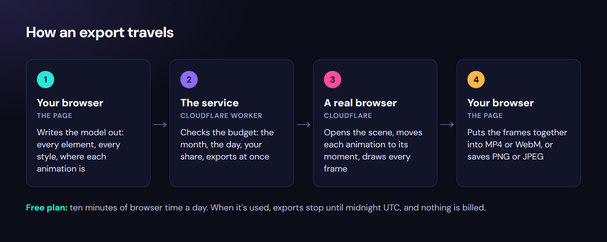
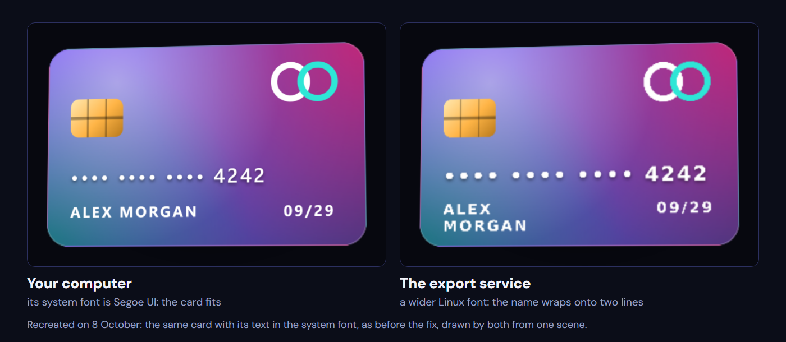
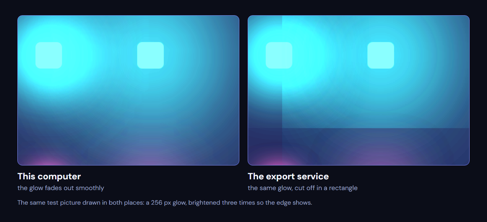
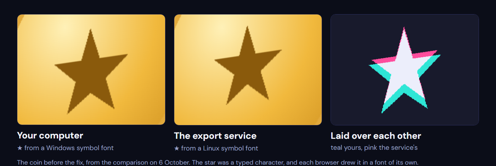

# Ten free minutes a day

*Every model in CSS 3D Lab can be saved as a picture or a video. Making that work on Cloudflare's free tier took three weeks, a counter that lied, and one rule I wasn't willing to break: it must stop, not bill.*

## Why a picture needs a server

You'd think saving a picture of something on a web page would be easy. It isn't. A page has no clean way to photograph itself. Screen sharing asks permission and records your whole screen at whatever size it happens to be, and the libraries that redraw a page as an image mostly can't handle 3D transforms, which is everything CSS 3D Lab is made of.

We tried anyway. On 20 September the export drew each model inside your own browser, by turning the page into a picture with a built-in trick that doesn't understand 3D depth. A die came out as a blob, and a puzzle cube lost its middle layer. A cleverer version followed the same day: draw every face flat, then put the faces back together in 3D. Model after model still found new ways to come out wrong, and the next day the drawing moved to a real browser on a server, the same kind of engine that draws the model on your screen.

So the export works like this. Your browser writes the model out exactly as it is: every element, every style and where each animation is at that moment. It sends that to a small service on Cloudflare, which opens it in a real browser of its own, draws the frames, and streams them back. Your browser then puts them together into the video, or saves the picture.

As in the rest of CSS 3D Lab, Claude wrote the code. My part was asking for things, trying them, and asking awkward questions when something didn't add up. Several of the turning points below started as one of those questions.

## Ten minutes a day

The service runs on Cloudflare's free plan. Its browser allowance is simple: ten minutes of browser time a day, for the whole account. When it's used up, exports stop until midnight UTC, and nothing is charged.

Ten minutes sounds like plenty for a picture that takes a few seconds. It wasn't, for a reason it took a while to see.

[numbers]
10 min | free browser time a day
3 min → 2–6 s | what one picture cost, before and after
89 | commits on the export, on 16 days in three weeks
159 | models compared on both browsers

## Three weeks, briefly

The first downloads, on 18 September, weren't live at all: videos filmed in advance and served as files. Three days later exports were drawn live on Cloudflare. The first test there was sobering: a picture took about 15 seconds, browser start included, and a 3-second video managed only 77 of its 90 frames before the service's time limit cut it off. The same day video got about three times faster, by sending each frame back as a compressed WebP instead of a PNG.

Then the problems came one at a time. Long videos were cut off by a fixed three-minute limit, which killed the longest exports of 18 models, so the limit now grows with the length of the video. A second picture taken straight after a first was refused, because Cloudflare's free plan allows only one new browser every 20 seconds, so the service started keeping its browser open for three minutes after each export, ready for the next. A spending ceiling arrived too: one counter on Cloudflare that every export has to ask before it starts. And refusals learned to say which limit they had hit.

## The fonts that didn't travel

The strangest problem in those weeks wasn't about time at all. On 25 September a payment card exported from the live site came back with its card number, 4242, running off the edge, and a name that fits on one line wrapped onto two. On my computer it looked fine.

The reason was fonts. The export sent the model but not its fonts, so each browser drew the text in whatever it had installed. My Windows laptop has Segoe UI and Consolas; Cloudflare's browser runs on Linux and has neither, and its stand-ins are wider. The fix was to make every export carry its own fonts: Inter and JetBrains Mono, packed in with the scene.

Two days later it turned out those fonts had never actually loaded. A build tool had quietly rewritten the path to the font files, so every one of them failed. And once that was fixed, seven chart models still asked for the computer's own default font by name instead of Inter, so the packed fonts never reached them. On the treemap, a label ran 7.8% past the edge of the exported picture.

The check that should have caught it compared file sizes, not pictures, and the treemap passed with its label off the frame. That's why the comparison now looks at the pictures themselves.

## Smaller surprises

Some problems had nothing to do with time or fonts.

Videos came out slightly darker and greener than the model on screen. The video file didn't say which colours it was written in, so players guessed, and guessed wrong. The fix was to label the colours inside every file.

4K was in the dialog for a few days. The free service runs out of memory and time drawing frames that size, so first the button said "coming later", and then it went away completely. A button for something that doesn't exist is worse than no button.

And a see-through video, with no background behind the model, can't be made in any browser today. The option says so plainly, instead of failing halfway through.

## The day it ran out

On 4 October, two releases in one day used up all ten minutes. The release checks draw a few models on the service to compare them with my own computer, and they share the same allowance as everyone else. For the rest of that day nobody could export anything.

The next morning I asked how much was actually left. To answer that, the service got a small page that reports its own count. It said six of ten minutes were used, while Cloudflare had already refused.

The counter was wrong, and the reason was the three-minute keep-alive. The service charged three minutes when it opened a browser, and nothing when an export reused one that was already open. But Cloudflare counts every second a browser is open, busy or idle.

## Pay, rent, or stay free

The obvious fix was money. Cloudflare's paid plan is $5 a month and includes ten hours of browser time. I also looked at Browserless, a hosted-browser service (about $25 a month for its first paid plan, billed yearly), and at renting my own small server on DigitalOcean (roughly $6–12 a month for one with enough memory for a browser).

What decided it was a question about the paid plan: what happens if something goes wrong? Cloudflare's paid plan has no hard cap: past what it includes, it bills. The service's own ceiling would cover browser time, but not everything, like a flood of requests, and a bill that is probably $5 isn't the same as one that can't be more. Even a fixed-price server can charge for extra traffic. The free plan is the one that simply stops.

I wanted a service where I know it will stop when the limit is reached. And honestly, almost nobody uses exports yet. So: stay free, and make the ten minutes go much further.

## What if someone skips the page?

Before changing anything I asked one more question: the page limits a video to 30 seconds, but what if someone sends a request without the page?

The service did check that itself: anything over 900 frames, or over the size limits, was refused before a browser opened. But the question exposed a worse hole. The largest export it accepts can keep a browser busy for about sixteen minutes, and an export that reused an open browser cost the counter nothing. On the free plan Cloudflare's own limit would stop it. On a paid plan it would have been a bill the service never saw.

## The rework

Three changes, all on the free plan:

- **One browser per export, closed when it's done.** No keep-alive, so no idle minutes. A picture went from costing about three minutes to 2–6 seconds, so the same ten minutes now hold more than a hundred pictures instead of about three.
- **Count the real time.** Before an export starts, the service reserves its worst case; when the browser closes, it records what it actually took.
- **Limits that hold whatever sends the request:** a monthly ceiling, at most three exports at once, the day's total, and a share for each visitor so one person can't use up everyone's day.

Testing it live found three more bugs. A second export straight after a first was refused with "out of exports for today": Cloudflare's 20-second rule again, reported as if the day were over. Exports now queue about twenty seconds apart instead. The per-visitor share counted running exports at their worst case, so two pictures in flight used up a visitor's three minutes after 26 real seconds. And the timer started after the browser opened, missing the opening itself.

Each of those took one live test to find and one change to fix. The release checks now carry a private key so they don't use a visitor's share, and they print what's left before they spend any of it.

## Two browsers, one picture

With exports cheap, there was room for something that had never fit before: drawing every model on the service and comparing it with the same picture drawn on my computer. All 159 of them.

Most matched. The few that differed taught me two things about drawing in someone else's browser.

Soft glows come out weaker there, and very large ones get cut off in a rectangle instead of fading out:

And, as the last part of the font story, a few characters, ★, ♠, →, ▾ and ⅓, aren't in the two fonts the export carries, so each browser drew them in a substitute font of its own. Eight models used them.

They're now drawn as shapes, and a check asks the fonts about every character every model shows, so it can't happen again. That one also fixed something nobody had noticed: visitors' own devices were each drawing their own stars too.

The comparison itself had to change as well. One average over the whole picture couldn't tell a harmless glow from a missing part. It now judges the fine detail and the soft areas separately, by the worst small square in the picture, and I tested it on pictures damaged on purpose to make sure it still catches real breakage.

## What I'd tell someone trying this

- **Ask what your counter actually counts.** Mine counted when a browser opened. The bill counted every second it was open.
- **A free plan that stops is a feature.** When nobody is depending on it yet, a hard stop is worth more than headroom.
- **Ask what happens if someone skips your page.** Limits in the page are suggestions; limits in the service are rules.
- **Test it live, on the real thing.** Every one of the last bugs looked fine until a real export hit it.

## From frontend developer to product engineer

I started as a frontend developer. Servers, browser quotas, billing plans and video encoding were the parts of a project I'd happily leave to someone else. When AI came along I had to adapt, and my work moved from the front end to the whole product. These days my title says product engineer, and this project shows what that means for me: through all of this I never read the service's code, and I didn't need to.

Claude did that part. It read Cloudflare's own pricing and limits pages before comparing plans. It measured what an export really cost on the live service instead of guessing. It explained every trade-off in plain words, so the decisions stayed mine: stay free, keep the hard stop, fix the counter. And when something broke, it traced the problem back to its cause: a counter that charged for opening a browser but not for keeping it open, a rule that refuses a second browser for 20 seconds, a font that Linux doesn't have.

It isn't magic, and it isn't always right. Several bugs in this story were in code Claude had written itself a few days earlier, and some of its first explanations were wrong until a live test showed otherwise. What made it work was testing on the real thing, and questions. "Why do we need to switch?" "What if someone bypasses the frontend?" "Shouldn't it apply to all models?" I didn't need to understand how the backend worked. I needed to know what to ask about it, and that is the part of the job I adapted to.

You can try it on any model in [CSS 3D Lab](https://css3dlab.edgarasneverdauskas.com): open one, press Image or Video, and it's drawn by the service this story is about, within its ten free minutes a day.
