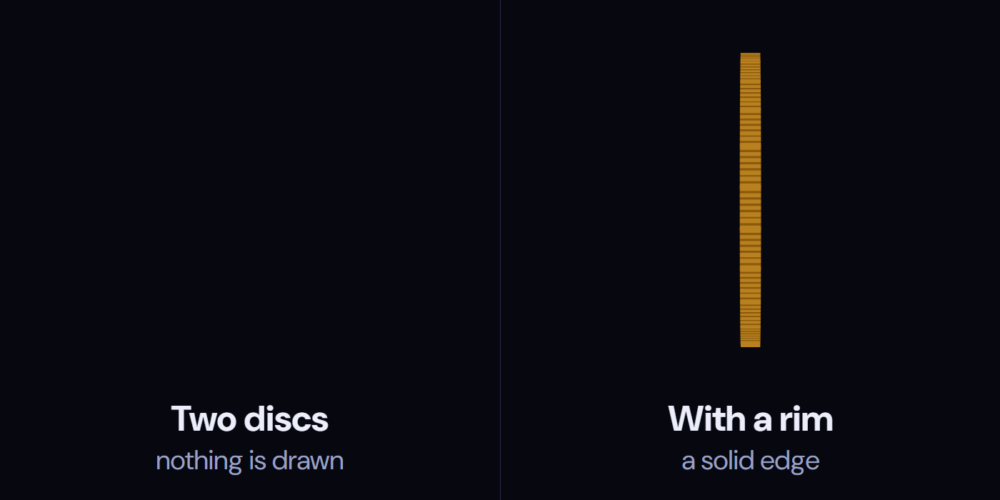
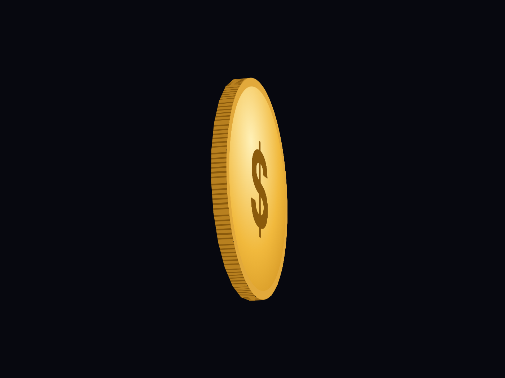
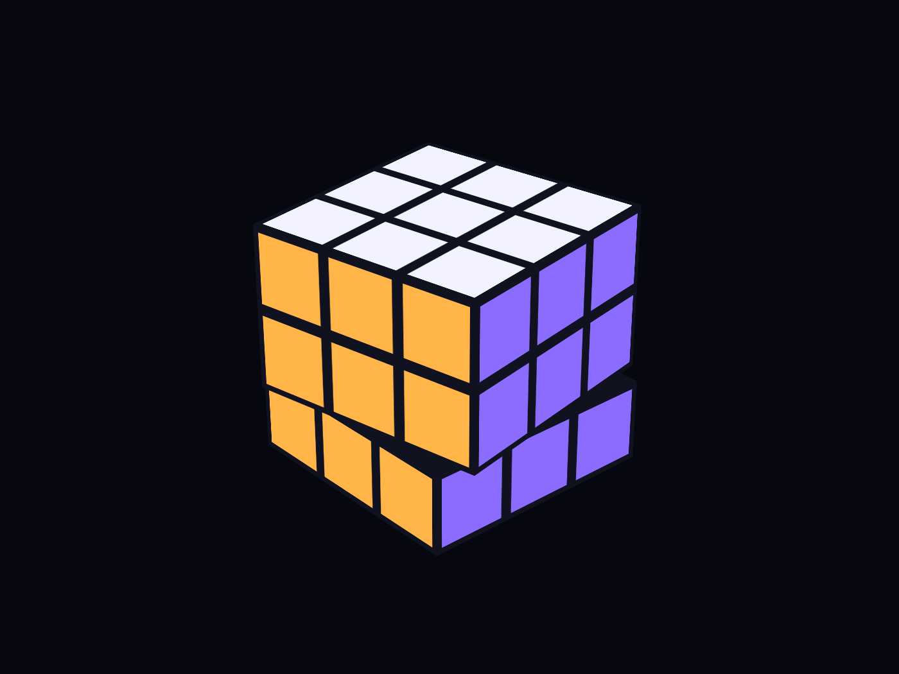
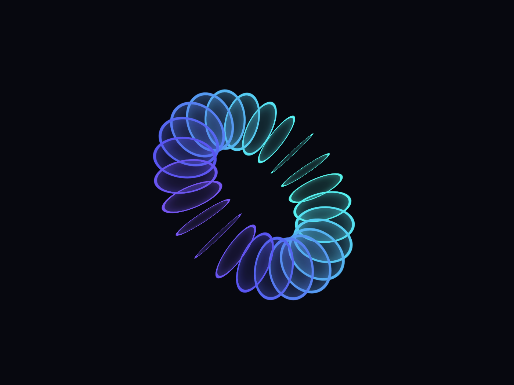
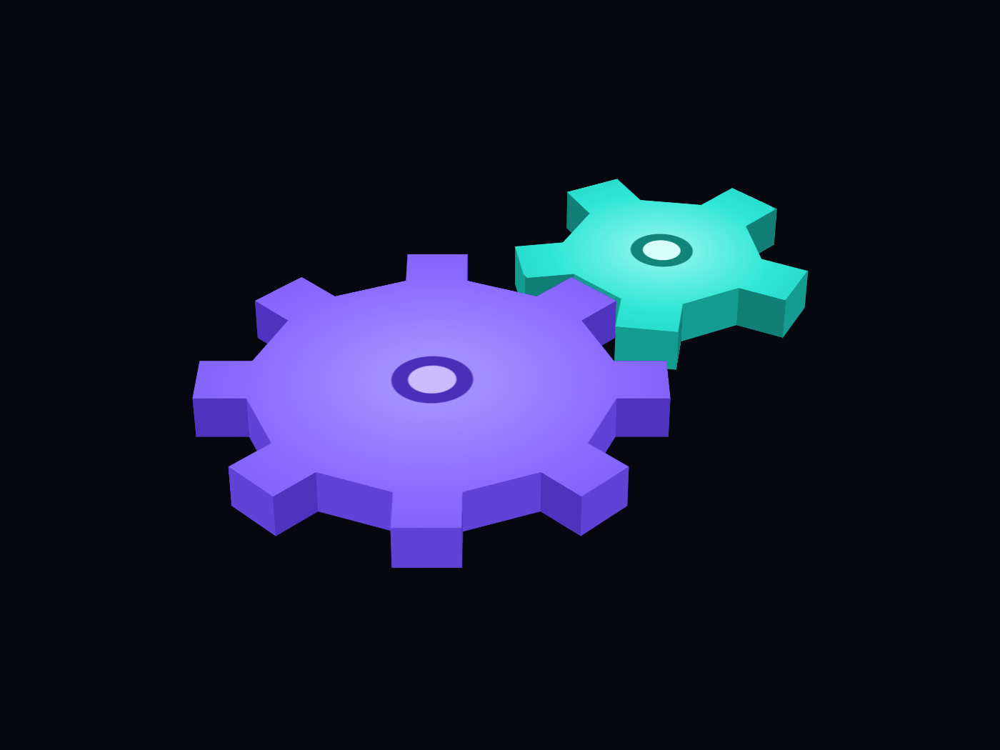

# Every solid in CSS is made of paper

*CSS 3D Lab has 30 shapes and solids, and not one of them is solid. Four of them show the tricks that make flat elements pass for a coin, a puzzle cube, a donut and a pair of gears.*

## How these get made

I don't write the CSS in CSS 3D Lab. Claude does. My part is asking for things, often fairly random ones, and looking hard at what comes back: does it hold up when it turns, from every side, at every size? I'm less a developer here than someone curious about what a web page is actually able to draw, and a bit of a tester.

The Shapes & solids group is where that curiosity runs into CSS's biggest limit.

## Paper in a 3D room

CSS can turn an element in three dimensions, push it towards you and look at it through a perspective. What it can't do is give anything thickness. Every element stays a flat rectangle. There is no sphere in CSS, no box and no volume, only flat pieces arranged so your eye fills in the rest.

That works until you look from the side. A flat element seen exactly edge-on is zero pixels thick, and the browser draws nothing at all. Most of the work in this group went into what happens at that moment.

## The coin: give the edge something to be

The obvious coin is two discs, a front and a back, pushed a little apart. It looks right until it turns edge-on, and then it's gone. Filling the gap with a stack of discs doesn't help: every disc in the stack is flat too, and vanishes with the others.



So the coin has a real rim: 24 thin slats stood around the edge. Each one is turned to its place on the circle, walked out to the edge and stood up facing outwards:

```css
.coin i {
  transform: rotateZ(calc(var(--i) * 15deg)) translateY(calc(-74.5 * var(--u))) rotateX(90deg);
}
```

Edge-on, the slats facing you become a solid, ridged edge, like a real coin's.



It's 59 lines of CSS and no JavaScript. [Try the coin](https://css3dlab.edgarasneverdauskas.com/models/coin/) and pause it edge-on.

## The puzzle cube: don't build what never moves on its own

A 3×3×3 puzzle cube is 27 small cubes, which is 162 faces. But in this animation a horizontal layer only ever turns as one piece, so it doesn't need to be nine cubes. Each layer is one flat box with the nine stickers painted on with gradients: three boxes instead of 27 cubes.

The layers take turns with one line each. All three run the same 12-second loop, started a second apart:

```css
.layer { animation: twist 12s cubic-bezier(0.65, 0, 0.35, 1) infinite; }
.layer:nth-child(2) { animation-delay: -11s; } /* one second later */
.layer:nth-child(3) { animation-delay: -10s; } /* two seconds later */
```

After four quarter turns every layer is back where it began, so the cube solves itself on every loop.



[Watch the cube twist](https://css3dlab.edgarasneverdauskas.com/models/rubik/).

## The torus: build round things from slices

A donut is a circle swept around an axis, so it can be built from its cross-sections: 24 identical circles, each turned to its own angle and moved out from the centre.

```css
.torus i {
  /* 24 × 15deg = 360deg; translateX keeps each ring edge-on to the circle */
  transform: rotateY(calc(var(--i) * 15deg)) translateX(calc(56 * var(--u)));
}
```

The detail that matters is the last step of that transform. Moved forwards (`translateZ`), each circle would lie flat against the path, like a panel on a carousel. Moved sideways (`translateX`), it stays edge-on to the path, like a slice through the tube, and the slices together read as a ring.



[See the torus](https://css3dlab.edgarasneverdauskas.com/models/torus/).

## The gears: the coin's trick, on every edge

A gear face is one element cut to the outline of eight teeth, with a copy behind it for the back. Edge-on it has the coin's problem, so it gets the coin's answer: a standing strip on every straight edge of the outline. The tip of each tooth is placed exactly like a slat on the coin's rim: turned to its place, walked out to the edge, stood up.

The two gears really mesh. While the big one turns once, the small one turns 576° the other way, exactly eight of its teeth going past, so the loop ends in the pose it started from.



[Turn the gears](https://css3dlab.edgarasneverdauskas.com/models/gear/).

## Three rules from 30 shapes

Across the whole group, the same three ideas keep coming back:

- **Give every edge something to be.** A flat piece vanishes edge-on, so anything that can face you sideways needs a real surface there.
- **Merge what moves together.** If parts never move on their own, make them one piece and paint the detail on.
- **Build round things from slices.** Turn identical pieces around an axis and let the eye join them.

The other 26, from a sphere and an hourglass to a crystal and a tetrahedron, are on the [Shapes & solids page](https://css3dlab.edgarasneverdauskas.com/groups/shapes/), each with a live preview and the code to copy.
